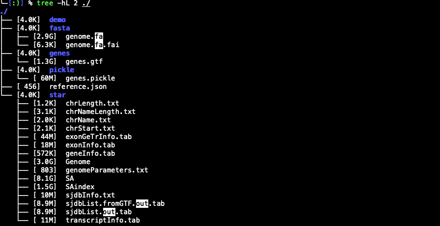

<!--
 * @Author: wangje
 * @Date: 2025-12-13 21:56:05
-->

# 10X 分析工具CellRanger学习

## 1. cellranger count

官方教程：https://www.10xgenomics.com/support/software/cell-ranger/latest/tutorials/cr-tutorial-ct

`cellranger count` 是 10x Genomics 官方用于**单细胞 RNA-seq（scRNA-seq）数据定量分析**的核心命令，主要功能是将单细胞测序的原始 fastq 文件与参考基因组比对，生成细胞级别的基因表达矩阵。

### 1.1 cellranger count下载和安装

目前的cellranger版本已经更新到了Cell Ranger 10.0.0 (Nov 13, 2025)，如果需要下载历史版本，可以通过访问[https://www.10xgenomics.com/support/software/cell-ranger/downloads/previous-versions](https://www.10xgenomics.com/support/software/cell-ranger/downloads/previous-versions)进行下载。**参考数据整体比较大，如果服务器下载速度过慢，也可以本地下载，并上传至服务器。**
### 1.2 Cell Ranger 各版本核心变化对比表（v7.0.0 至 v10.0.0）
| 版本       | 发布时间   | 核心功能/优化                                                                 | 兼容性/支持要求                                                                 |
|------------|------------|------------------------------------------------------------------------------|---------------------------------------------------------------------------------|
| **v10.0.0** | 2025-05    | 1. 新增“多组学联合聚类”功能，整合基因表达、ATAC、蛋白数据联合分析2. 支持Gem-X Ultra芯片及8-plex高 multiplexing 文库3. 优化CRISPR筛选富集分析，提升基因效应量化精度4. UMAP降维速度较v9提升40%，大样本分析效率显著提升5. web summary新增“多组学关联视图” | 1. 支持2025-A版参考基因组（GRCh38/GRCm39注释更新）2. 兼容PTG抗体v2版蛋白文库3. 系统要求：Python 3.11+，CPU支持AVX2，内存≥64GB（100k细胞）4. 兼容Illumina NovaSeq X Plus最新数据 |
| v9.0.0     | 2024-11    | 1. 支持Gem-X Universal芯片OCM技术，适配4-plex 3' v4/5' v3文库2. 新增`cell ranger annotate`命令，实现自动化细胞类型注释3. aggr流程默认降维改为UMAP，速度提升2.5倍4. 内置Clonotype分组功能，简化免疫组库分析5. 优化VDJ文库比对逻辑，提升TCRBCR组装准确性 | 1. 支持2024-A版参考基因组2. 系统要求：CPU支持AVX，Python 3.10+3. 兼容3' v4、5' v3、VDJ v2等文库4. 支持CentOS 8、Ubuntu 20.04/22.04 |
| v8.0.0     | 2024-03    | 1. 首次支持Gem-X系列3' v4和5' v3文库，低丰度基因检出率提升15%2. 新增`min-crispr-umi`参数，自定义CRISPR guide计数阈值3. 优化HT文库EmptyDrops过滤，提升高细胞量样本检出准确性4. 蛋白分析新增“抗体批次校正”选项 | 1. 支持PTG抗体蛋白表达文库分析2. 实验性支持固定RNA样本CRISPR文库分析3. 系统要求：Python 3.9+，内存≥32GB（30k细胞）4. 兼容NextSeq 20005500数据 |
| v8.0.1     | 2024-05    | 1. 修复`--force-cells`参数匹配时报错问题2. 调整HT文库EmptyDrops背景范围至80k-160k，需手动指定文库类型3. 修复参考基因组无转录本注释导致的矩阵错误4. 优化web summary分群图表渲染速度 | 1. 完善HT文库兼容性，需指定`--chemistry=chromium-ht-v3`等参数2. 修复自定义参考基因组兼容性问题3. 继承v8.0.0系统要求和文库支持范围 |
| v7.2.0     | 2023-10    | 1. 新增“抗体背景校正”功能，优化蛋白定量结果2. ATAC分析新增“peak注释增强”模块，整合调控区域信息3. count流程内存占用降低20%4. 优化TCRBCR体细胞突变检测，提升TIL克隆分析准确性 | 1. 支持2023-B版参考基因组（更新HLA及小鼠免疫基因注释）2. 兼容3' v3.1、5' v2、VDJ v1.1等文库3. 系统要求：Python 3.9+，支持CentOS 7/8、Ubuntu 18.04/20.044. 支持NovaSeq 6000数据 |
| v7.0.0     | 2023-06    | 1. 支持NextSeq X Plus高产出数据（单样本达100Gb）2. 新增“批次效应可视化”模块3. 优化CRISPR guide比对效率，减少脱靶误判4. 简化多样本整合流程，aggr命令自动读取多count结果 | 1. 支持GemCode HT文库，适配最高100k细胞样本2. 弃用Python 3.7，要求Python 3.8+3. 内存要求：≥16GB（10k细胞），≥48GB（50k细胞）4. 不兼容v2系列旧文库 |

> 💡 说明：表格内容基于10x Genomics官方发布日志整理，实验性功能可能后续调整，实际使用请参考对应版本官方文档。

```pwsh
## 这里下载的时Cell Ranger 10.0.0版本
# 命令行使用curl下载
curl -o cellranger-10.0.0.tar.gz "https://cf.10xgenomics.com/releases/cell-exp/cellranger-10.0.0.tar.gz?Expires=1765682198&Key-Pair-Id=APKAI7S6A5RYOXBWRPDA&Signature=SO3tn4o50UYUViprsueJpWGbkOLqzAUxH8X4fbKgtr4LxexzQFLWWc~Og9I3AUpOKrntOLVFd0TTfJ63X5EuM2jl5fwLvMPVDg2Mh4liM0Lp87qzhyY6TsxdJkRs3UuMlelp3rc2ZATBG9O5yfo-Urxgx-dY5jsnpldy0hKg58XGe8-r6CGmOI1CzGAF4qpiCgJOzRbONK7QHDFTYcKey6Xmh7PT~KPRip24kUcKiJyJzyfhGNdfSACJbJgA02kLEBb2EmZasQFvfRoY0NPMFlnVpFkIv7-p73JA~CiYERWT0awbwdkPn7n7eXItlVktXA3Z2QwiT~DJfsc8eKC2rA__"

# 命令行使用wget下载
wget -O cellranger-10.0.0.tar.gz "https://cf.10xgenomics.com/releases/cell-exp/cellranger-10.0.0.tar.gz?Expires=1765682198&Key-Pair-Id=APKAI7S6A5RYOXBWRPDA&Signature=SO3tn4o50UYUViprsueJpWGbkOLqzAUxH8X4fbKgtr4LxexzQFLWWc~Og9I3AUpOKrntOLVFd0TTfJ63X5EuM2jl5fwLvMPVDg2Mh4liM0Lp87qzhyY6TsxdJkRs3UuMlelp3rc2ZATBG9O5yfo-Urxgx-dY5jsnpldy0hKg58XGe8-r6CGmOI1CzGAF4qpiCgJOzRbONK7QHDFTYcKey6Xmh7PT~KPRip24kUcKiJyJzyfhGNdfSACJbJgA02kLEBb2EmZasQFvfRoY0NPMFlnVpFkIv7-p73JA~CiYERWT0awbwdkPn7n7eXItlVktXA3Z2QwiT~DJfsc8eKC2rA__"

# 下载完成后安装cellranger
# 解压
tar -xzf cellranger-10.0.0.tar.gz
# 安装
cd cellranger-10.0.0/bin/
# 使用echo $0 查看当前shell类型
# 如果服务器中使用的是bash ，则执行如下命令
echo "export PATH=$(pwd):$PATH" >> ~/.bashrc && source ~/.bashrc 
# 如果服务器中使用的是zsh，则执行如下命令
echo "export PATH=$(pwd):$PATH" >> ~/.zshrc && source ~/.zshrc

# 验证安装成功
cellranger --version
```


### 1.3 cellranger count使用的参考文件下载

目前cellranger count使用的参数文件也做了更新，目前的版本为:2024-A，历史版本为：2020-A（[https://www.10xgenomics.com/support/software/cell-ranger/latest/release-notes/cr-reference-release-notes#2020-a](https://www.10xgenomics.com/support/software/cell-ranger/latest/release-notes/cr-reference-release-notes#2020-a)）。

<font color="red"> Human reference (GRCh38) - 2024-A</font>

```pwsh
# wget 下载
wget "https://cf.10xgenomics.com/supp/cell-exp/refdata-gex-GRCh38-2024-A.tar.gz"

# curl 下载
curl -O "https://cf.10xgenomics.com/supp/cell-exp/refdata-gex-GRCh38-2024-A.tar.gz"
# 选择一种下载方式，下载成功后解压文件
tar -xzf refdata-gex-GRCh38-2024-A.tar.gz
```
解压后的文件目录中包括如下的文件



* Mouse reference (GRCm39) - 2024-A

```pwsh
# wget下载
wget "https://cf.10xgenomics.com/supp/cell-exp/refdata-gex-GRCm39-2024-A.tar.gz"

# curl 下载
curl -O "https://cf.10xgenomics.com/supp/cell-exp/refdata-gex-GRCm39-2024-A.tar.gz"
# 选择一种下载方式，下载成功后解压文件
tar -xzf refdata-gex-GRCm39-2024-A.tar.gz
```

* Rat reference (mRatBN7.2) - 2024-A

```pwsh
# wget下载
wget "https://cf.10xgenomics.com/supp/cell-exp/refdata-gex-mRatBN7-2-2024-A.tar.gz"

# curl下载
curl -O "https://cf.10xgenomics.com/supp/cell-exp/refdata-gex-mRatBN7-2-2024-A.tar.gz"
# 选择一种下载方式，下载成功后解压文件
tar -xzf refdata-gex-mRatBN7-2-2024-A.tar.gz
```
### 1.4 cellranger count使用
<font color="blue"> 这里使用cellranger官方提供的示例数据，数据下载地址[https://www.10xgenomics.com/support/software/cell-ranger/8.0/tutorials/cr-tutorial-ct](https://www.10xgenomics.com/support/software/cell-ranger/8.0/tutorials/cr-tutorial-ct) </font>
```pwsh
mkdir run_cellranger_count && cd run_cellranger_count
wget https://cf.10xgenomics.com/samples/cell-exp/3.0.0/pbmc_1k_v3/pbmc_1k_v3_fastqs.tar
# 解包
tar -xvf pbmc_1k_v3_fastqs.tar

# 解包后的数据格式
#pbmc_1k_v3_fastqs/
#pbmc_1k_v3_fastqs/pbmc_1k_v3_S1_L001_R2_001.fastq.gz
#pbmc_1k_v3_fastqs/pbmc_1k_v3_S1_L002_I1_001.fastq.gz
#pbmc_1k_v3_fastqs/pbmc_1k_v3_S1_L001_R1_001.fastq.gz
#pbmc_1k_v3_fastqs/pbmc_1k_v3_S1_L002_R1_001.fastq.gz
#pbmc_1k_v3_fastqs/pbmc_1k_v3_S1_L002_R2_001.fastq.gz
#pbmc_1k_v3_fastqs/pbmc_1k_v3_S1_L001_I1_001.fastq.gz
```
**<font color="red">celkanger count在使用的时候需要提前对fastq数据进行命名，命名的格式必须官方给的格式，否则会报错。</font>**
[样本名]_S[样本编号]_L[泳道号]_R[读段类型]_001.fastq.gz，例如：Sample_S1_L00X_R1_001.fastq.gz， Lane 1: **L001** and Lane 2: **L002**.

| 字段          | 说明                                                                 | 示例                |
|---------------|----------------------------------------------------------------------|---------------------|
| `[样本名]`    | 自定义样本标识（如 sample1、PBMC_001），需唯一且不含特殊字符         | `PBMC_10k`          |
| `S[样本编号]` | 样本在测序批次中的编号（数字，如 S1、S2），可省略但建议保留           | `S1`                |
| `L[泳道号]`   | 测序仪的泳道号（数字，如 L001、L002），多泳道数据需区分               | `L001`              |
| `R[读段类型]` | 关键！区分不同读段：<br>R1：样本索引/条码读段（通常 8/10bp）<br>R2：基因表达读段（通常 98bp） | `R1` / `R2`         |
| `001`         | 固定后缀（Illumina 标准，代表测序循环编号），不可修改                 | `001`               |

cellranger count常用参数：

| 参数                | 简写示例              | 作用                              |
| ------------------- | --------------------- | --------------------------------- |
| `--id`              | `--id=pbmc1k`         | 输出文件夹名（必填）              |
| `--transcriptome`   | `--trans=/ref/GRCh38` | 参考索引路径（必填）              |
| `--fastqs`          | `--fastqs=./fastq`    | fastq 所在目录（必填）            |
| `--sample`          | `--sample=pbmc1k`     | 文件前缀，多 lane/多 Index 时必填 |
| `--expect-cells`    | `--expect-cells=3000` | 预期细胞数，提高 calling 精度     |
| `--force-cells`     | `--force-cells=3500`  | 强制细胞数，跳过自动 calling      |
| `--include-introns` | 开关                  | snRNA-seq 核内信号需打开          |
| `--localcores`      | `--localcores=16`     | 最大 CPU 数                       |
| `--localmem`        | `--localmem=64`       | 最大内存 (GB)                     |

```pwsh
# 使用cellranger count进行定量
cellranger count \
  --id=run_count_1kpbmcs \
  --fastqs=pbmc_1k_v3_fastqs \
  --sample=pbmc_1k_v3 \
  --transcriptome=refdata-gex-GRCh38-2020-A \
  --create-bam=true \
  --localcores=16 \
  --localmem=64
```
运行完成后输出的结果讲解。
```pwsh
├── analysis   # Cell Ranger 自动跑的 PCA、t-SNE、聚类、差异基因
├── cloupe.cloupe # 用 **Loupe Browser** 点选式看细胞分群、基因表达、差异基因的文件
├── filtered_feature_bc_matrix # 这个目录中的文件可以用于下游Seurat或Scanpy等软件使用
├── filtered_feature_bc_matrix.h5 # **HDF5 版**表达矩阵，比 `mtx` 读取更快，占用更小
├── metrics_summary.csv
├── molecule_info.h5  # **UMI 级别**信息
├── possorted_genome_bam.bam # 比对的BAM文件
├── possorted_genome_bam.bam.bai # 比对的BAM文件的索引文件
├── raw_feature_bc_matrix # 未过滤空液滴等指标的文件
├── raw_feature_bc_matrix.h5
└── web_summary.html # web报告文件
```

## 2 数据格式转换
### 2.1 不同格式数据生成Seurat对象数据
### 2.2 不同格式数据生成Anndata对象数据

## 3 去批次聚类分群
好的，根据您的要求，我已将这些单细胞算法的对比整理为 Markdown 表格形式：

### 3.1 单细胞去批次与整合算法对比表

| 算法 | 优势 | 适用场景 |
| --- | --- | --- |
| **Harmony** | 速度极快，内存占用低，效果稳健 | 大多数常规 scRNA-seq 整合的首选 |
| **Seurat CCA** | 准确度高，与 Seurat 生态深度集成 | 批次较少、生物学差异较细微的情况 |
| **scVI** | 非线性建模能力强，支持海量数据 | 数十万级以上细胞量，或复杂批次效应 |
| **LIGER** | 擅长多组学整合 | 转录组与 ATAC-seq 或蛋白组联用 |
| **BBKNN** | 计算开销极小 | 快速预览结果或极大型图构建 |

### 3.2 harmony算法

Harmony 并非直接修改原始的基因表达矩阵，而是作用于低维空间，如主成分分析（PCA）生成的嵌入坐标 。这种设计不仅极大提高了计算效率，还避免了由于直接修改计数数据而可能引入的分布扭曲 。Harmony 的核心逻辑是一个迭代过程，主要包括四个关键步骤：软聚类（Soft Clustering）、计算全局与批次质心、学习线性校正因子以及细胞特异性调整 。这些步骤共同作用，使得 Harmony 能够有效地去除批次效应，同时保留生物变异。

Harmony 的主要优点包括：
- **速度极快**：Harmony 的计算速度非常快，能够处理数百万个细胞的数据。
- **内存占用低**：Harmony 的内存占用相对较低，适合在内存有限的计算环境中运行。
$$min_{R,Y} \sum_{i,k} R_{ki} ||Z_i - Y_k||^2 + \sigma R_{ki} \log R_{ki} + \sigma \theta R_{ki} \log\left(\frac{O_{ki}}{E_{ki}}\right)\phi_i$$
在这一公式中，$Z_i$ 是细胞的特征向量，$Y_k$ 是簇质心，$\sigma$ 控制聚类的“平滑度”，而 $\theta$ 是关键的多样性惩罚参数 1。$O_{ki}$ 代表细胞在簇和批次中的观察共现频率，而 $E_{ki}$ 代表独立性假设下的预期频率 。当某个簇过度由单一批次的细胞占据时，惩罚项会显著增加，从而迫使算法寻找能够整合多个数据集的特征组合 。

为了防止过度校正（Overcorrection），Harmony 采用了岭回归（Ridge Regression）惩罚项 $\lambda$ 。$\lambda$ 的存在确保了校正因子的估计是稳健的，特别是在某些批次中细胞数量极少的情况下 16。每个细胞最终接收到的校正量是其所属所有簇校正向量的加权平均值 。Harmony 采用线性模型，优点是解释性强、计算极其快速、且不容易产生虚假的过拟合；而 scVI 采用非线性模型，能够处理极其强烈的非线性批次效应，但对小样本数据可能过于敏感 。


#### Seurat4中harmony的用法


## 其他分析
### 单细胞HLA分析之arcasHLA

### 单细胞HLA分析之scHLAcount

### 单细胞HLA分析之HLA-HD